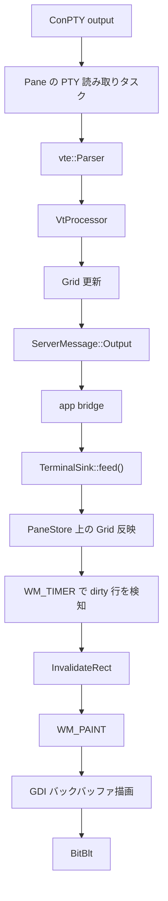
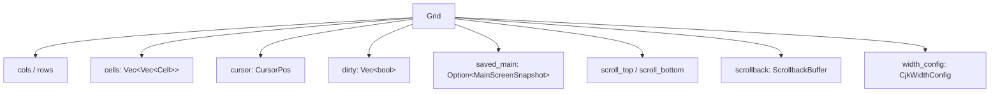
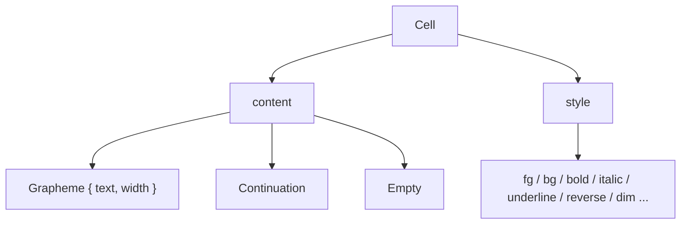
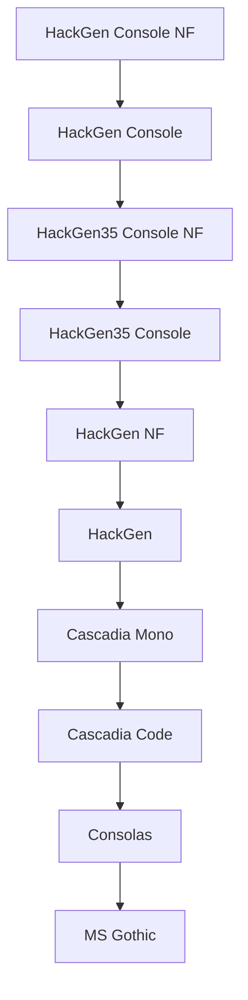

## 全体の流れ

サーバー側でも `Grid` は更新されているが、クライアントは描画専用に
`TerminalSink` を持っており、受信した生バイト列を再適用してローカルの Grid を更新する。
この構成にすると、描画は server crate に依存しない。

## `Grid` の役割

`crates/terminal/src/grid/mod.rs`
の `Grid` は、単なる 2 次元文字配列ではない。

- セル配列
- カーソル位置
- DECAWM / LCF などの端末フラグ
- オルタネートスクリーン退避領域
- DECSTBM スクロール領域
- スクロールバック
- dirty 行

を 1 つにまとめた仮想スクリーンバッファだ。

## セル表現

`Cell` は内容とスタイルを持つ。内容は `CellContent` で表現され、
全角文字の右側を `Continuation` で埋める方針は現行実装でも同じだ。

この表現により、

- 全角文字
- VS-16 による絵文字化
- ZWJ を含む複合絵文字

を「1 書記素 = 1 描画単位」として扱いやすくしている。

## VT シーケンス処理

`VtProcessor` は `vte::Perform` を実装し、主に次を更新する。

| コールバック | 主な用途 |
|------------|---------|
| `print` | 通常文字の書き込み |
| `execute` | CR / LF / BS / BEL |
| `csi_dispatch` | カーソル移動、消去、スクロール領域、SGR |
| `osc_dispatch` | タイトル変更、OSC 52、通知、OSC 133;D |

現行実装で重要なのは、`VtProcessor` が文字描画だけでなく
**通知・クリップボード・コマンド完了** まで抽出している点だ。

- `notification: Option<String>`
- `clipboard_data: Option<Vec<u8>>`
- `command_finished: Option<Option<i32>>`
- `bell: bool`

これらは後段で `PaneEvent` や `pending_clipboard` に変換される。

## CJK と書記素幅

[**他ターミナルでずれた CJK カーソル表示と、yatamux で揃った表示の比較スクリーンショットを差し込む予定**]

幅計算は `CjkWidthConfig` が握る。方針は明確で、
**ConPTY のカーソル位置を信頼しない**。

特に明示的に処理しているのは次のケース。

- 半角カタカナ濁点 `U+FF9E` / `U+FF9F`
- East Asian Ambiguous 文字
- VS-16 を含む絵文字化シーケンス
- NFD の韓国語を NFC 正規化してから測るケース

行末の全角文字は `DECAWM + LCF` を使って早期折り返しする。
この処理がないと、2 セル文字が行末で半分だけ次行に流れる。

## スクロールバックとオルタネートスクリーン

`Grid::SCROLLBACK_MAX` は 50,000 行。
ただし常に保存するわけではない。

- フルスクリーンの通常スクロールは scrollback に積む
- DECSTBM で限定されたサブリージョンスクロールは積まない
- オルタネートスクリーン中は積まない

この挙動により、shell の履歴は残しつつ、
vim / less の一時画面をスクロールバックに混ぜない。

## GDI 描画パイプライン

`crates/client/src/window/mod.rs`
の `paint()` はフルバックバッファ方式だ。

1. `CreateCompatibleDC` / `CreateCompatibleBitmap` でバックバッファ作成
2. テーマ色で背景塗りつぶし
3. `PaneStore` から現在のレイアウトと Grid 参照を取得
4. 各ペインを描画
5. セパレーター、ステータスバー、トースト、各種ランチャーを重ねる
6. `BitBlt` で画面へ転送

dirty 行は `WM_TIMER` 側の再描画トリガー判定に使っており、
現行の `paint()` 自体は「必要になったら見えている範囲を丸ごと描き直す」実装になっている。

## 罫線文字を直接描く理由

[**フォント依存の罫線崩れと GDI 直描画後の比較スクリーンショットを差し込む予定**]

box-drawing 文字は `ExtTextOutW` に丸投げせず、
一部を `MoveToEx` / `LineTo` / `FillRect` で描く。
理由は単純で、フォントに依存すると neovim のボーダーが安定しないからだ。

文字として描くのではなく「図形として描く」ことで、
フォント差より UI の一貫性を優先している。

## フォント選択

起動時はインストール済みフォントから候補順に選ぶ。

日本語表示、Nerd Font 系グリフ、Windows 標準環境のフォールバックの順で
妥協点を探した結果がこの優先順位だ。
