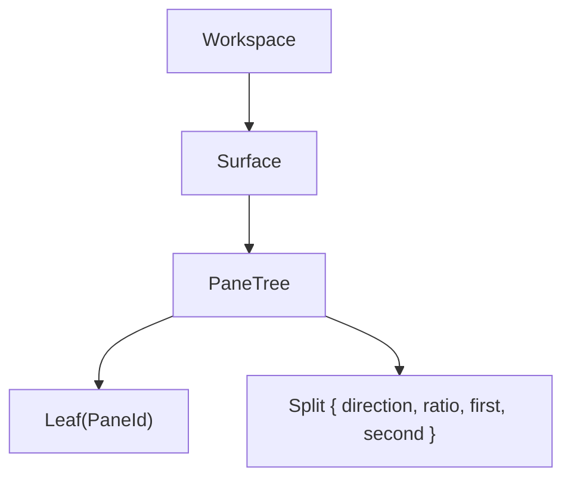
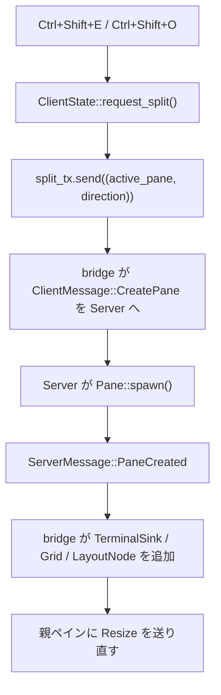
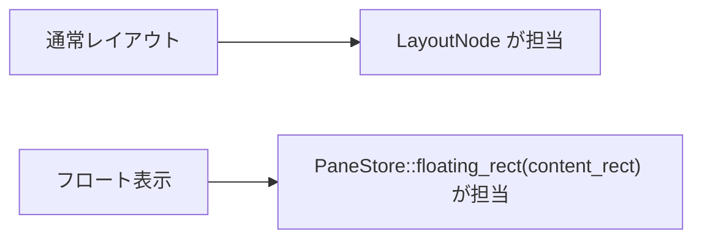
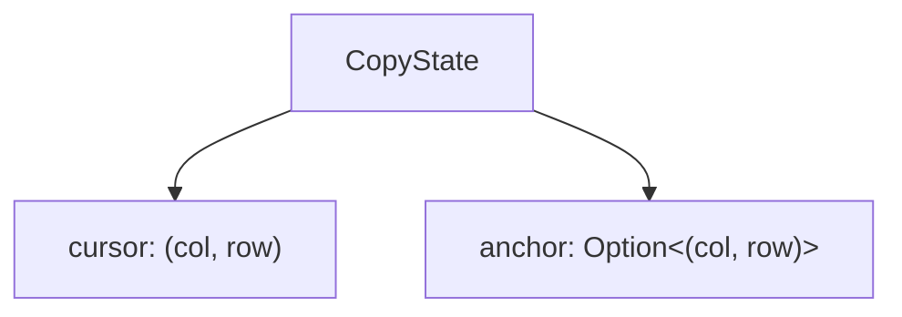
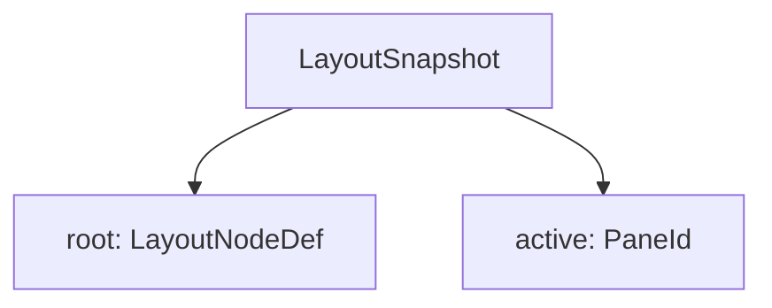

## 階層構造

サーバー側のセッション階層は今も 3 段だ。

ただし GUI 描画はこの木を直接使わず、
client crate 側で同型の `LayoutNode` を持ち直している。

- サーバー: `crates/server/src/session/model.rs` の `PaneTree`
- クライアント: `crates/client/src/layout/tree.rs` の `LayoutNode`

分離している理由は、サーバーは PTY とセッション整合性を管理し、
クライアントはピクセル矩形と UI 状態を計算する責務だからだ。

## `PaneStore` が持つ UI 状態

現行実装のペイン管理は、レイアウト木そのものより
`PaneStore` が何を持っているかを見ると分かりやすい。

主なフィールド:

- `grids: HashMap<PaneId, Arc<Mutex<Grid>>>`
- `layout: LayoutNode`
- `active: PaneId`
- `scroll_offset`
- `floating` / `floating_visible` / `pre_float_active`
- `launcher`
- `copy_mode`
- `save_prompt`
- `theme_launcher`
- `pane_commands`

この 1 か所に UI の可変状態を集約しているので、
bridge 側も Win32 側も更新対象を迷いにくい。

## キーバインド体系

### ノーマルモード

| キー | 動作 |
|------|------|
| `Ctrl+Shift+E` | 縦分割 |
| `Ctrl+Shift+O` | 横分割 |
| `Ctrl+Shift+W` | アクティブペインを閉じる |
| `Ctrl+Tab` / `Ctrl+Shift+Tab` | 次 / 前のペインへ移動 |
| `Ctrl+矢印` | 最近傍ペインへ移動 |
| `Ctrl+F` | フローティングペイン表示切り替え |
| `Ctrl+P` | テーマランチャー |
| `Ctrl+B` | ペインモード |

### ペインモード

`Ctrl+B` で入り、ステータスバーの表示が切り替わる。

| キー | 動作 |
|------|------|
| `E` / `O` | 縦 / 横分割 |
| `W` | ペインを閉じる |
| `F` | フローティング表示切り替え |
| `X` | スクロールバックを `$EDITOR` で開く |
| `L` | レイアウトランチャー |
| `S` | 保存プロンプト |
| `V` | コピーモード |
| `<` / `>` | 縦分割比を ±5 % 調整 |
| `+` / `-` | 横分割比を ±5 % 調整 |
| `q` / `Esc` | ノーマルモードへ戻る |

実装上は one-shot ではなく、操作内容によってはそのままモードに残る。
たとえば `V` なら Copy モードへ、`S` なら保存プロンプトへ遷移する。

## 分割フロー

### GUI 起点

bridge は `pending: VecDeque<(PaneId, SplitDirection, TermSize)>` を持ち、
どの GUI 操作に対応する `PaneCreated` かを照合している。

### IPC 起点

`yatamux split-pane` の場合は、`ServerMessage::PaneCreated` に
`split_from` と `direction` が入って返る。
bridge はそれを見てクライアント側 `LayoutNode` を補正する。

つまり現在の分割同期は、

- GUI 起点なら pending キュー
- IPC 起点なら `PaneCreated` のメタデータ

の二経路を持っている。

## フローティングペイン

[**中央にオーバーレイ表示されたフローティングペインのスクリーンショットを差し込む予定**]

フローティングペインは `LayoutNode` に含めない。
`PaneStore.floating` と `PaneStore.floating_visible` で別管理する。

初回 `Ctrl+F` では通常の `CreatePane` を 1 枚発行し、
作成された PaneId を `floating` に記録する。
以後は表示/非表示だけを切り替える。

## コピーモードと通常選択

### コピーモード

`CopyState` は現在 `cursor` と `anchor` の 2 つだけを持つ。

選択中かどうかは毎回 `is_selected()` で計算する。
以前のような固定レンジ保持ではなく、カーソルとアンカーから導出する形だ。

### 通常のマウス選択

Normal モードの左ドラッグは `normal_selection` に別管理される。
こちらはコピー専用 UI ではなく、ドラッグ終了時にそのままクリップボードへ送る。

つまり現行実装では、

- キーボード主導の `copy_mode`
- マウス主導の `normal_selection`

が別系統で共存している。

## ペイン削除と終了

削除はまずサーバーへ `ClosePane` を送り、
実際の木構造更新は `PaneClosed` を受けたあとに行う。

bridge 側の処理:

1. `sinks` と `grids` から対象を削除
2. フローティング対象なら `floating = None`
3. 通常レイアウトなら `LayoutNode::remove_pane()` を呼ぶ
4. フォーカス先があれば `active` を移す
5. `grids` が空なら `should_quit = true`

最後の 1 ペインを閉じたときも特別扱いせず、
`WM_TIMER` 側が `should_quit` を見て `DestroyWindow` する。

## セッション保存と復元

### `session.toml`

終了時は `LayoutSnapshot` を `%APPDATA%\yatamux\session.toml` に保存する。

`LayoutNodeDef` は `LayoutNode` のシリアライズ専用ミラー型で、
`Grid` を含まない。

### 復元時の実装

起動時は `load_initial_layout()` が `session.toml` を読み、
旧 PaneId から新 PaneId へのマッピングを作りながら再帰的に `CreatePane` していく。
これにより、保存時のアクティブペインも復元できる。

## 宣言的レイアウトと保存レイアウト

### 読み込み

`%APPDATA%\yatamux\layouts\<name>.toml` は `[[panes]]` の列で定義する。
各エントリは「直前のペインからどう分割するか」を持つ。

### 保存

現在のレイアウトを保存するときは `layout_to_toml()` が DFS で木をたどり、
線形な `[[panes]]` 列に落とす。

このとき `pane_commands` に記録されているコマンドだけが `command = "..."` として残る。
つまり、

- レイアウトファイルから適用されたコマンドは保存対象
- 手入力したコマンドは保存対象外

という設計になっている。

これは「レイアウトとして再現可能な情報だけを保存する」という割り切りだ。
