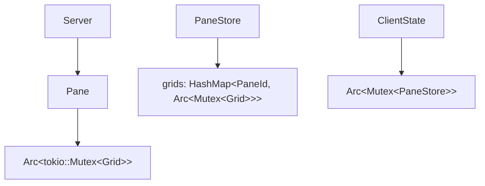

この章は現行コードの索引用リファレンスとして使う想定で、
「頻出する型がどの crate に属し、何を所有しているか」を中心に整理している。

## 先に押さえる 3 点

1. 通信の境界は `protocol` crate の `ClientMessage` / `ServerMessage`
2. 表示の境界は `terminal` crate の `Grid`
3. UI 状態の境界は `client` crate の `PaneStore`

この 3 つだけ先に頭に入れておくと、他の型の位置づけが追いやすい。

## `yatamux-protocol`

ワイヤを流れる型だけを置く crate。

```text
WorkspaceId(u32)
SurfaceId(u32)
PaneId(u32)

TermSize { cols, rows }
SplitDirection { Horizontal | Vertical }

PaneInfo {
  id,
  surface,
  title,
  cols,
  rows,
}

CursorInfo {
  col,
  row,
  visible,
}

PaneCapture {
  title,
  cols,
  rows,
  lines_requested,
  scrollback_len,
  cursor,
  visible_text,
  scrollback_tail,
}
```

### `ClientMessage`

```text
CreateWorkspace { name }
CreateSurface { workspace }
CreatePane { surface, split_from, direction, size, working_dir }
Input { pane, data }
Resize { pane, size }
ClosePane { pane }
RequestScreen { pane }
Detach
ListPanes
CapturePane { pane, lines, plain_text }
```

### `ServerMessage`

```text
WorkspaceCreated { id, name }
SurfaceCreated { id, workspace }
PaneCreated { id, surface, split_from?, direction? }
Output { pane, data: Arc<[u8]> }
TitleChanged { pane, title }
Notification { pane, body }
ClipboardWrite { pane, data }
PaneClosed { pane }
CommandFinished { pane, exit_code? }
Error { message }
PanesListed { panes }
PaneContent { pane, content, capture? }
```

## `yatamux-terminal`

端末エミュレーションのコア。

```text
CjkWidthConfig

TerminalSink
  grid: Arc<Mutex<Grid>>
  parser: vte::Parser
  fn feed(&mut self, data) -> Option<Vec<u8>>

Grid
  cols / rows
  cells
  cursor: CursorPos
  dirty
  saved_main
  scroll_top / scroll_bottom
  scrollback
  width_config

CursorPos { col, row }

Cell
  content: CellContent
  style: CellStyle

CellContent
  Grapheme { text, width }
  Continuation
  Empty

CellStyle
  fg, bg, bold, italic, underline, reverse, dim ...
```

### PTY 関連

```text
PtySession
  fn spawn(size, shell, output_tx, working_dir)
  fn write(&mut self, data)
  fn resize(&mut self, size)
  fn take_child()
  fn clone_child_killer()
```

### VT 関連

```text
VtProcessor<'a>
  grid: &'a mut Grid
  current_style
  title
  notification
  clipboard_data
  command_finished
  bell
  → impl vte::Perform
```

ここで通知やクリップボードまで抜いているのが、現在の terminal crate の特徴だ。

## `yatamux-server`

セッション階層と PTY ライフサイクルを管理する。

```text
Server
  workspaces: HashMap<WorkspaceId, Workspace>
  surfaces: HashMap<SurfaceId, Surface>
  panes: HashMap<PaneId, Pane>
  next_*_id
  width_config: CjkWidthConfig
  client_tx: Sender<ServerMessage>
  pane_output_rx / tx
  pane_event_rx / tx
```

### セッションモデル

```text
Workspace
  id
  name: Arc<str>
  surfaces: Vec<SurfaceId>
  active_surface

Surface
  id
  workspace
  pane_tree: Option<PaneTree>
  active_pane

PaneTree
  Leaf(PaneId)
  Split { direction, ratio, first, second }
```

### ペイン

```text
Pane
  id
  grid: Arc<tokio::sync::Mutex<Grid>>
  cmd_tx: Sender<PtyCmd>
  title: Arc<std::sync::Mutex<Arc<str>>>
  size: Arc<std::sync::Mutex<TermSize>>
  child_killer

PtyCmd
  Input(Vec<u8>)
  Resize(TermSize)

PaneEvent
  Notification(String)
  Bell
  ProcessExited
  CommandFinished(Option<i32>)
```

`Pane` は server 内部型であり、protocol crate には出てこない。

## `yatamux-client`

UI と描画を担当する crate。

### レイアウト関連

```text
LayoutNode
  Leaf(PaneId)
  Split { direction, ratio, first, second }

PaneRect { x, y, w, h }
Direction { Left, Right, Up, Down }

LayoutPreview
  node: LayoutNode
  commands: Vec<Option<String>>

LauncherState
  entries: Vec<(String, Option<LayoutPreview>)>
  selected

ThemeLauncherState
  entries: Vec<String>
  selected
```

### `PaneStore`

```text
PaneStore
  grids: HashMap<PaneId, Arc<Mutex<Grid>>>
  layout: LayoutNode
  active: PaneId
  pending_clipboard: Option<Vec<u8>>
  pending_toasts: VecDeque<Toast>
  scroll_offset: usize
  floating: Option<PaneId>
  floating_visible: bool
  pre_float_active: Option<PaneId>
  should_quit: bool
  launcher: Option<LauncherState>
  copy_mode: Option<CopyState>
  normal_selection: Option<(usize, usize, usize, usize)>
  save_prompt: Option<String>
  theme_launcher: Option<ThemeLauncherState>
  pane_commands: HashMap<PaneId, String>
```

### UI 補助型

```text
CopyState
  cursor: (usize, usize)
  anchor: Option<(usize, usize)>

Toast
  pane_id
  message
  elapsed_ms
```

### セッション永続化

```text
LayoutNodeDef
  Leaf { id }
  Split { direction, ratio, first, second }

LayoutSnapshot
  root: LayoutNodeDef
  active: PaneId
```

`LayoutNode` は描画時の実体、`LayoutNodeDef` は保存時の鏡像型という関係だ。

### Win32 側の実行状態

```text
ClientState
  panes: Arc<Mutex<PaneStore>>
  ime: ImeHandler
  msg_tx
  split_tx
  float_tx
  layout_tx
  active_toasts
  content_rect
  app_focused
  native_notif_queue
  mode: Cell<ClientMode>
  theme: Cell<WinTheme>

ClientMode
  Normal
  Pane
  Copy
```

## ルート crate (`src/`)

workspace を束ねる型はここにある。

```text
AppConfig
  hooks: HooksConfig
  appearance: AppearanceConfig

HooksConfig
  on_pane_created
  on_pane_closed

AppearanceConfig
  font_family
  font_size
  background
  foreground
  cursor
  selection_bg
  status_bar_bg
```

### 起動と bridge

```text
BootstrapHandles
  client_tx
  server_rx
  ipc_out_tx
  surf_id
  pane_id

BridgeEvent
  PaneOutput
  PaneCreated
  PaneClosed
  UserNotification
  CommandFinished
```

## 所有関係の最重要ポイント



server の `Grid` と client の `Grid` は別インスタンスで、
client 側は `TerminalSink` が PTY 生データを再適用して画面を保っている。
この点は monolith 的に 1 つの Grid を共有していた時期の説明と混同しやすいので注意したい。

## 型の追い方

実装を読むときは、次の順序が分かりやすい。

1. `protocol` のメッセージ型を確認する
2. `server::handle_client_message()` で入口を見る
3. `pane.rs` と `terminal` crate で PTY と Grid の更新を見る
4. `app/bridge.rs` で GUI 側への反映を見る
5. `client::window` で描画と入力を見る

この順に追うと、workspace 分割されていても迷いにくい。
